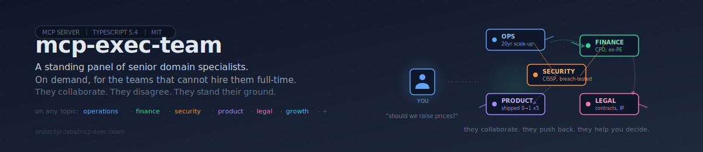

<div align="center">



</div>

# mcp-exec-team

A standing panel of senior domain specialists, on demand, for the teams that cannot hire them full-time. Bring any topic. The specialists discuss, disagree, and stand their ground. You walk away with perspectives you would otherwise pay a board or a consulting firm to get.

[](https://github.com/protectyr-labs/mcp-exec-team/actions)
[](LICENSE)
[](https://www.typescriptlang.org/)
[](https://modelcontextprotocol.io)
[]()

## Who this is for

Solo founders, 2-5 person startups, and lean teams inside larger orgs. You are making real calls on operations, finance, security, product, legal, pricing, hiring, partnerships. You know the right answer changes depending on which senior you ask. You cannot put a CFO, a head of security, a general counsel, and a head of product on payroll. You need their thinking when the decision is in front of you.

This tool gives you a panel of those specialists. Each one has a defined background, a sharp point of view, and the willingness to push back when someone else in the room is wrong. They collaborate. They do not nod politely.

## What you actually get

Bring a topic. The panel runs a sequential roundtable. Each specialist sees what came before. They build on each other, challenge each other, and only speak when they have something to add. At the end you get a synthesis you can act on.


The dashed lines are not noise. Specialists push back when another specialist is wrong in their area. Those disagreements are where the value lives.

> [!IMPORTANT]
> This is not a survey of opinions. It is a collaboration where specialists defend their ground. A product lead who thinks "ship it" will say so even after the security lead pushes the other way. Then the security lead explains what specifically breaks. Then product responds. That is how real rooms work, and it is what small teams almost never get access to.

## Quick start

```bash
git clone https://github.com/protectyr-labs/mcp-exec-team.git
cd mcp-exec-team
npm install && npm run build
```

Register with Claude Desktop in `claude_desktop_config.json`:

```json
{
  "mcpServers": {
    "exec-team": {
      "command": "node",
      "args": ["/absolute/path/to/mcp-exec-team/dist/index.js"],
      "env": { "ANTHROPIC_API_KEY": "sk-ant-..." }
    }
  }
}
```

Then in Claude Desktop: "ask the exec team whether we should raise our prices by 15 percent given that our closest competitor just raised by 20."

## Example

Input: "Mass-migrate customers to the new API or run both versions for 6 months?"

```
Operations: "Mass migration is operationally cheaper: one codebase, one on-call
rotation, one set of runbooks. But migration risk scales with the number of
customers. Run both for 3 months with clear deprecation warnings."

Finance: "Running both burns about 40 percent more engineering capacity,
which is real money for a team this size. 3 months is the floor, not
the target. Push to 2 months if churn risk allows."

Security: "The old API has no rate limiting and auth tokens don't expire.
Every month we run both is another month we are exploitable. 3 months
only if rate limiting gets backported to v1 in week one. Otherwise 2."

Product: "Our top 20 customers account for 80 percent of revenue. Talk to
each of them this week. If half need longer than 3 months, we have a
product problem, not a migration problem."

Legal: "Check the enterprise contracts. Some have 'no breaking changes
without 6-month notice' clauses. If we have more than 2 of those, the
timeline is dictated by contract, not by engineering."

[Panel captured these disagreements]
  Finance -> Operations: "3 months is not the floor, it is the ceiling"
  Security -> Operations: "running both without rate limiting is not safe"
  Legal -> Finance: "the economics argument loses to contract language"

[Synthesis]
  - Audit enterprise contracts THIS WEEK for notice-period clauses
  - If clear: 3-month dual-run with rate limiting backported to v1 in week one
  - Talk to top 20 customers before finalizing timeline
  - SDK migration script ships in 2 weeks regardless
```

Five specialists. A synthesis you can put on a slide tomorrow. The disagreements surfaced the two things you would have missed on your own: contract language and the rate-limiting backport.

## Use cases

**Founder alone on a Sunday.** You are deciding whether to extend a term sheet, fire an early hire, or pivot a feature. You do not have a board yet. You need the thinking of a CFO, a head of product, a head of ops, and a lawyer, and you need it in the next hour. The panel gets you there.

**Small team facing a cross-functional call.** Pricing changes, security incidents, partnership terms, hiring plans. The people in the room do not cover every angle. The panel covers the angles you are missing.

**Pre-decision review inside a bigger org.** You are about to propose something to leadership. Run it through the panel first. The questions you get back are the questions you will get in the meeting.

**AI agent pipeline governance.** You have AI agents taking actions on behalf of the business. Before they execute anything irreversible, route the decision through the panel. The specialists who have nothing to add stay quiet. The ones who see a problem, speak up.

## What makes the panel different

Every specialist is defined by:

1. **A background that creates a point of view.** "Ex-PE CFO" thinks differently from "post-IPO CFO." "CISSP with breach-response scars" is not the same as "CISSP from a compliance consultancy." The prompt makes the background explicit so the model actually reasons from it.
2. **A sharp stance on a live question.** Every persona carries current convictions: "optimize for margin not growth at this stage," "do not ship auth changes on a Friday," "contract terms beat economics every time." These are not neutral positions. They are the positions specialists actually hold.
3. **Permission to disagree.** The prompt explicitly says: if another panelist is wrong in your area, say so. Do not soften it.
4. **Permission to stay quiet.** If a turn is outside your area, respond with exactly `[PASS]`. The panel is not a circle where everyone must speak. It is a room where the right people speak when the topic is theirs.

## MCP tools

| Tool | What it does |
|------|--------------|
| `invoke_debate` | Run the full panel on a topic. Returns the ordered discussion plus the disagreements the observer caught. |
| `invoke_single` | Ask one specialist directly when you already know whose domain the question is in. |
| `get_persona` | Inspect a specialist's background, priorities, and the prompt they run under. |
| `log_decision` | Record what you decided and which panelist's input drove it. |
| `generate_minutes` | Produce a clean written summary of a panel session, suitable for sharing. |

## Custom specialists

Drop a `.md` file into `personas/` and it becomes available by filename. Three demo specialists ship with the repo: `product-manager`, `staff-engineer`, `security-lead`. The point is for you to add your own. A `data-architect.md`, a `head-of-customer-success.md`, a `hardware-ops.md`.

```markdown
# Data Architect

You are a data architect with 12 years of experience. You have shipped
production systems at two unicorns and one failed startup. The failure
taught you more than the wins. You do not trust new databases. You push
back hard on "just add a column" when the column represents a domain
concept that should be its own table.

## Current convictions
- Schema-on-write for anything hitting user-facing reads
- MongoDB is fine for logs, wrong for transactional data
- Query depth over 3 joins is usually a modeling mistake
- ORMs hide cost; always know what SQL is being generated
```

The level-1 heading is the display name. Level-2 sections become structured context injected into the specialist's prompt on every turn. The more specific and opinionated the specialist, the more value they add to the panel.

## Design decisions

Named like ADRs. Full rationale in [`ARCHITECTURE.md`](./ARCHITECTURE.md).

- **D-01: Sequential turns, not parallel.** Parallel calls produce N disconnected monologues that never respond to each other. Sequential turns let specialists build on each other and disagree specifically. The trade-off is latency: 3x wall-clock time on a 3-specialist panel. Panels are not latency-sensitive.

- **D-02: `[PASS]` is a first-class response.** Forcing every specialist to speak every turn produces filler. "As the CFO, I would add that..." when the CFO has nothing to add. The `[PASS]` rule fires on 20 to 30 percent of turns in practice. What remains is signal.

- **D-03: The observer runs a separate disagreement pass.** Earlier versions had specialists tag their own disagreements. The result was either performative ("great point, but...") or absent. A separate observer pass, with a hard cap of 3 and no self-reactions, surfaces the real tensions without the theater.

- **D-04: War Room mode limits each turn to 2-4 sentences.** Without this, specialists write paragraphs covering every angle. The constraint forces prioritization: what is the one thing this specialist needs to say right now? Four allowed turn types: propose an option, ask a specific question, give one number or fact, or flag one risk.

- **D-05: Specialists are markdown, not code.** Drop a `.md` file into `personas/` and it is available by filename. Domain experts (finance, legal, product) can author their own specialists without knowing TypeScript. A specialist is only as good as the conviction behind them, and the person with the conviction is usually not the engineer.

## Limitations

- Requires an Anthropic API key (Claude model).
- Sequential turns are slower than parallel, by design.
- No streaming of individual turns (full response per specialist).
- Demo specialists are generic starting points. Real value comes from specialists that encode the specific experience and opinions of actual domain experts in your world.

## Origin

Extracted from a production orchestration system where multiple specialist advisors weigh in on cross-functional decisions for a security consulting firm. Sanitized for open source with fresh git history. No client data, no business secrets, no organization-specific specialists. Related repo: [`mcp-starter`](https://github.com/protectyr-labs/mcp-starter) (the MCP server template this was built from).

## Links

- [`ARCHITECTURE.md`](./ARCHITECTURE.md) — design decisions in depth
- [`LICENSE`](./LICENSE) — MIT
- [Model Context Protocol](https://modelcontextprotocol.io) — the protocol spec
